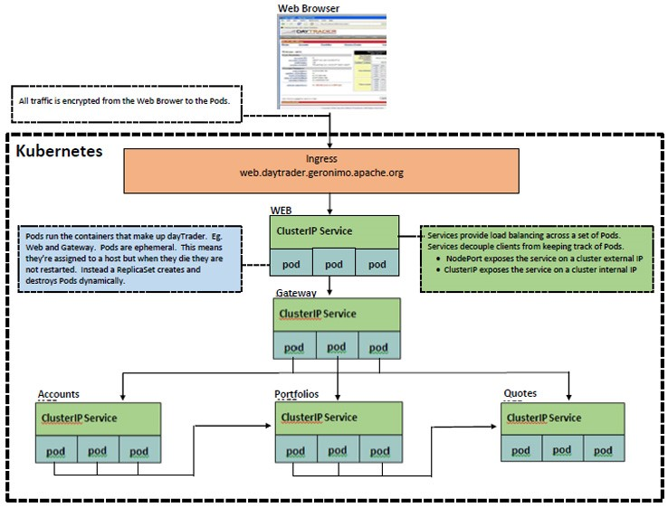

# DayTrader Web

The Web UI to the DayTrader business operations

## Monolithic Architecture
DayTrader is multi-tier application is built around the paradigm of an online stock trading system. Example business operations include
login, register, view portfolio, lookup stock quotes, and buy or sell stock. DayTrader was originally developed by IBM and donated 
to the Apache Geronimo community in the 2005 timeframe. The DayTrader architecture is representitive of monolithic applications that 
many businesses are still using. For that reason, we selected it to clarify the techniques for refactoring a monolith to microservices. 
For the monolithic architecture, see [daytrader - a more complex application](http://geronimo.apache.org/GMOxDOC30/daytrader-a-more-complex-application.html). 

## Microservices Architecture

Consider the following microservices architecture diagram. In this architecture, the Web is responsible for the UI to the DayTrader business operations. It accepts 
incoming requests from the browser and delegates them to the [Gateway Microservice](https://github.com/jpmorganchase/daytrader-example-gatewayrepo/). The 
Gateway Microservice in turn redirects the request to the ([Accounts Microservice](https://github.com/jpmorganchase/daytrader-example-accountsrepo/), 
[Portfolios Microservice](https://github.com/jpmorganchase/daytrader-example-portfoliosrepo/), or 
[Quotes Microservice](https://github.com/jpmorganchase/daytrader-example-quotesrepo/); which implements that business operation. All of these componenets are Spring Boot applications.



This README shows you how to build and push a Docker image for the Web Application and how to deploy that Docker image to a Kubernetes Cluster. 

## Prerequisites

1.  [Install Java 8](http://www.oracle.com/technetwork/java/javase/downloads/index.html)

2.  [Install Maven 3.3.9+](https://maven.apache.org/download.cgi)

3.  [Install Docker](https://www.docker.com/get-docker)
    
4.  [Create DockerHub Account](https://hub.docker.com/)

## Configuration

Maven must be able to authenticate to your DockerHub account so it can push Docker images

1.  In `daytrader-web/pom.xml` change the ${user.name} to your DockerHub user name:

    ```xml
    <docker.image.prefix>${user.name}</docker.image.prefix>
    ``` 

2.  In `daytrader-web/env/external/k8s/web-deployment.yaml`, change the image to your DockerHub username

    ```yaml
    image: YOUR_DOCKERHUB_USERNAME/daytrader-gateway:4.0.18
    ```

3.  In `daytrader-web/pom.xml`, you don't have to change the <tag>, but if you do, change the above version too.
        
    ```xml
    <tag>4.0.18</tag>
    ```

4.  In `~/.m2/settings.xml`, add the following so Maven can push images to your DockerHub account

    ```xml
    <servers>
        <server>
            <id>docker.io</id>
            <username>YOUR_DOCKERHUB_USERNAME</username>
            <password>YOUR_DOCKERHUB_PASSWORD</password>
        </server>
    </servers> 
    ```

## Setup
You will need a cluster to run the application. If you already have a cluster with the NGINX Ingress Controller installed then feel free to use it. If not, we have provided instructions to help you setup a cluster on Minikube, Amazon EKS, Google Kubernetes Engine, and Azure Kubernetes Service. We have also tested the application on those platforms. For additional information see [Picking the right Solution](https://kubernetes.io/docs/setup/pick-right-solution/).  

1.  [Setup on Minikube](docs/MINIKUBE.MD)

2.  [Setup on Amazon EKS](docs/EKS.MD)

3.  [Setup on Google GKE](docs/GKE.MD)

3.  [Setup on Azure AKS](docs/AKS.MD)


### Run on Local Development Server

1.  Build the Web UI

    `$ cd daytrader-webapp`
    `$ mvn -Plocal clean install`

2.  Start the Web UI

    `$ cd daytrader-web`
    `$ ./env/ext/bin/start_server.sh`
    
3.  Test the Web UI

    Pre-Condition: Start the microservices
                                   
    a.  Open your browser and navigate to: `https://localhost:5443`

    b.  Under The Configuration Tab

        * Press(Re)-create DayTrader Database Tables and Indexes
        * Press (Re)-populate DayTrader Database
        * Press Test Daytrader Scenario

    c.  Keep refreshing the browser until you are satisfied DayTrader is working correctly. 

        Note: each time you refresh the browser, it runs another functional test scenario. 
   
    d.  That's it! You have now tested the daytrader
    
    Post-Condition: Stop the microservices
    
4.  Access the Swagger UI

    Pre-Condition: Start the microservices
    
    Open your browser and navigate to: `https://localhost:5443/swagger-ui.html`
    
    Post-Condition: Stop the microservices
    
4.  Stop the Web UI

    `$ ./env/ext/bin/stop_server.sh`
                             


### Run on Kubernetes Cluster

1.  Start the Web UI

    `$ cd daytrader-webapp`
    `$ mvn -Pcd clean install`
  
2.  Test the Web UI

    Pre-Condition: Start the microservices
                                   
    a.  Open your browser and navigate to: `https://web.daytrader.geronimo.apache.org`

    b.  Under The Configuration Tab

        * Press(Re)-create DayTrader Database Tables and Indexes
        * Press (Re)-populate DayTrader Database
        * Press Test Daytrader Scenario

    c.  Keep refreshing the browser until you are satisfied DayTrader is working correctly. 

        Note: each time you refresh the browser, it runs another functional test scenario. 
   
    d.  That's it! You have now tested the daytrader
    
    Post-Condition: Stop the microservices
    
4.  Access the Swagger UI

    Pre-Condition: Start the microservices
    
    Open your browser and navigate to: `https://web.daytrader.geronimo.apache.org/swagger-ui.html`
    
    Post-Condition: Stop the microservices
    
4.  Stop the Web UI

    `$ mvn -Pcd clean`
                             
    
## Steps to Generate the Docker Image

These steps were very straightforward and easy to perform.
 
### Create the Dockerfile
    
The `Dockerfile` is where you defines all the commands to setup the environment and start the Web UI in the container.

```yaml
FROM openjdk:8-jdk
VOLUME /tmp
MAINTAINER Donald Vines <donald_vines@hotmail.com>
# Set ssl variables
ENV DAYTRADER_KEYSTORE_FILENAME=/var/ssl/daytrader/keystore.jks
ENV DAYTRADER_KEYSTORE_PASSWORD=password
ENV DAYTRADER_TRUSTSTORE_LOCATION=/var/ssl/daytrader/truststore.jks
ENV DAYTRADER_TRUSTSTORE_PASSWORD=password
# Set app variables
ENV DAYTRADER_APP_VERSION=4.0.0
ENV DAYTRADER_APP_ARTIFACTID=daytrader-accountsapp
ENV DAYTRADER_WAR_ARTIFACTID=daytrader-accounts
# Set database variables
ENV DAYTRADER_DATABASE_DRIVER=org.apache.derby.jdbc.EmbeddedDriver
ENV DAYTRADER_DATABASE_URL='jdbc:derby:tradesdb;create=true'
ENV DAYTRADER_DATABASE_USERNAME=xxx
ENV DAYTRADER_DATABASE_PASSWORD=xxx
# Set tomcat variables
ENV SERVER_PORT=1443
ENV SERVER_PORT_HTTPS=1443
# Make port visible
EXPOSE 1443
# Set service routes
ENV DAYTRADER_ACCOUNTS_SERVICE=https://daytrader-accounts
ENV DAYTRADER_GATEWAY_SERVICE=https://daytrader-gateway
ENV DAYTRADER_PORTFOLIOS_SERVICE=https://daytrader-portfolios
ENV DAYTRADER_QUOTES_SERVICE=https://daytrader-quotes
# Set logging variables
ENV DAYTRADER_LOG_FILENAME=/var/log/daytrader/$DAYTRADER_APP_ARTIFACTID-$DAYTRADER_APP_VERSION.log
ENV DAYTRADER_LOG_LEVEL=TRACE
ENV DAYTRADER_LOG_APPENDER=ConsoleAppender
# Create the log folder
RUN mkdir -p -m 0777 /var/log/daytrader
# Create the log file and set permissions
RUN touch $DAYTRADER_LOG_FILENAME
RUN chmod 666 $DAYTRADER_LOG_FILENAME
# Create the ssl folder
RUN mkdir -p -m 0777 /var/ssl/daytrader
# Add the truststore to the container and set permissions
ARG JKS_FILE=target/$DAYTRADER_WAR_ARTIFACTID-$DAYTRADER_APP_VERSION/WEB-INF/classes/truststore.jks
ADD ${JKS_FILE} $DAYTRADER_TRUSTSTORE_LOCATION
RUN chmod 666 $DAYTRADER_TRUSTSTORE_LOCATION
# Add the application's war to the container
ARG WAR_FILE=target/$DAYTRADER_WAR_ARTIFACTID-$DAYTRADER_APP_VERSION.war
ADD ${WAR_FILE} app.war
ENV JAVA_OPTS="-Djavax.net.ssl.trustStore=/var/ssl/daytrader/truststore.jks -Djavax.net.ssl.trustStorePassword=password"
ENTRYPOINT exec java $JAVA_OPTS -jar app.war
```

### Add Dockerfile Maven Plugin

In `daytrader-webapp/daytrader-web/pom.xml`, add the [Dockerfile Maven Plugin](https://github.com/spotify/dockerfile-maven) and specify the DockerHub account. 
        
```xml
<plugin>
    <groupId>com.spotify</groupId>
    <artifactId>dockerfile-maven-plugin</artifactId>
    <version>${dockerfile-maven-version}</version>
    <executions>
        <execution>
            <phase>package</phase>
            <goals>
                <goal>build</goal>    <!-- Builds the Docker image -->
                <goal>push</goal>     <!-- Pushes the Docker image -->
            </goals>
        </execution>
    </executions>
    <configuration>
        <repository>${docker.image.prefix}/${project.artifactId}</repository>
        <tag>4.0.18</tag>
        <buildArgs>
            <JAR_FILE>target/${project.artifactId}-${project.version}.war</JAR_FILE>
        </buildArgs>
        <useMavenSettingsForAuth>true</useMavenSettingsForAuth>   <!-- Authenticates to your DockerHub account -->
    </configuration>
</plugin>
```

### Build and Push the Docker image

With the `Dockerfile` and the `Dockerfile Maven Plugin` in place, we can use Maven to build and push the Docker image to DockerHub.

`$ cd daytrader-webapp`
`$ mvn -Pcd clean install`

This command creates an image with the version <tag> you specified in the configuration. For rolling update, we can update this <tag>. 
    
    
## Steps to Deploy to Kubernetes Cluster

Deployment to Kubernetes required a number of manual steps. Some of these steps were to specify the configuration of the resources; others were to create the resources; and still others were used to verify the deployment. You only have to specify the configuration once; after that you can use it to create the resources. The creation of resources has be done whenever you do a deployment. As such they should be automated via Maven. The other other steps to verify the deployment should only used by developers troubleshooting a problem. Before automating though it is important to first identify the manual steps which is what we do in this section. It is important to note that these steps were completely portable across the Kubernetes platforms that we tested. This means that you write once and run anywhere. This is great news for DevOps!


### Create the Deployment for our Container

#### Use `yaml` to specify the deployment configuration

The `deployment.yaml` is where you specify the containers that will host your application along with other specs
    
```yaml
apiVersion: extensions/v1beta1
kind: Deployment
metadata:
  labels:
    app: daytrader-web
  name: daytrader-web
  namespace: default
spec:
  replicas: 1
  selector:
    matchLabels:
      app: daytrader-web
  template:
    metadata:
      labels:
        app: daytrader-web
    spec:
      containers:
      - name: daytrader-web
        image: dhvines/daytrader-web:4.0.18
        imagePullPolicy: Always
        ports:
        - containerPort: 5443
          protocol: TCP
        readinessProbe:  
          httpGet:
            path: /health
            scheme: HTTPS
            port: 5443
          initialDelaySeconds: 30
          periodSeconds: 30
          timeoutSeconds: 10
        livenessProbe:  
          httpGet:
            path: /health
            scheme: HTTPS
            port: 5443
          initialDelaySeconds: 30
          periodSeconds: 30
          timeoutSeconds: 10
          failureThreshold: 4
        env:
        - name: ACCOUNTS_SERVICE_ROUTE
          value: https://daytrader-accounts
        - name: GATEWAY_SERVICE_ROUTE
          value: https://daytrader-gateway
        - name: PORTFOLIOS_SERVICE_ROUTE
          value: https://daytrader-portfolios
        - name: QUOTES_SERVICE_ROUTE
          value: https://daytrader-quotes
        - name: GET_HOSTS_FROM
          value: dns
```

#### Use `kubectl apply -f` to create the deloyment resource

1.  `$ kubectl apply -f deployment.yaml`

    This command creates a Deployment resource, which creates the ReplicaSet, which then creates the Pods
    
2.  `$ kubectl get pods`
    
    NAME | READY | STATUS | RESTARTS | AGE
    ---- | ----- | ------ | -------- | ---
    daytrader-web-xxxxxxxxx-xxxxx | 1/1 | Running | 0 | 6m
    
    Wait until you see READY `1/1` and STATUS `Running`
              
3.  Review the pods (application) logs
        
    `$ kubectl logs <POD_NAME> -f`
    
    You should see `Tomcat started on port(s): 5443 (https)`
    
#### Use `kubectl port-forward` to test the connection
        
1.  `$ kubectl port-forward <POD_NAME> 8888:5443`
    
    This command forwards local port 8888 to port 5443 of your pod
       
    You should see `Forwarding from 127.0.0.1:8888 -> 5443`
       
2.  `$ curl -k https://127.0.0.1:8888/health`

    You should see `{"status":"UP"}` 
            
        
### Create the Service for our Pod

The Service load balances requests across the Pods. Remember that the pods are ephemeral. So if one of them stops, the ReplicaSet will 
create a replacement, but that Pod will have a different IP address. For that reason, clients should not communicate directly with the 
application in a Pod. Instead clients should talk to applications via their service. 
    
#### Use `yaml` to specify the service configuration

The `service.yaml` is where you specify the selector for the backend pods along with other specifications

```yaml
apiVersion: v1
kind: Service
metadata:
  labels:
    app: daytrader-web
  name: daytrader-web
  namespace: default
spec:
  ports:
  - port: 443
    protocol: TCP
    targetPort: 5443
  selector:
    app: daytrader-web
  sessionAffinity: None
  type: ClusterIP
```

#### Use `kubectl apply -f` to create the service resource

1.  `$ kubectl apply -f service.yaml`
           
2.  `$ kubectl get services`
        
    NAME | TYPE | CLUSTER-IP | EXTERNAL-IP | PORT(S) | AGE
    ---- | ---- | ---------- | ----------- | ------- | ---
    daytrader-web | NodePort | 10.7.254.225| <none> | 443:30650/TCP | 23s
       
    The above command creates a service resource. This resource listens on the CLUSTER IP and PORT. It is backed by endpoints 
    to one or more pods. You can see the enpoints buy doing `kubectl get endpoints`. When the service receives an HTTPS request,
    it selects one of the endpoints (pods) and forwards the HTTPS request to the pod. The application running inside the pod 
    handles the request and returns an HTTPS response.
            
    See also [Kubernetes Concepts - Services, Load Balancing, and Networking](https://kubernetes.io/docs/concepts/services-networking/service)

#### Use `kubectl proxy` to test the connection
                        
1.  Start the proxy to locates and authenticate to the API Server.
    
    `$ kubectl proxy`
        
    You should see `Starting to serve on 127.0.0.1:8001`
            
2.  If you get a port binding error then find the processId for that server and kill it 

    `$ lsof -P | grep ':8001'`
    `$ kill -9 processId`

3.  Test the connection using the `curl` command

    `$ curl -k http://localhost:8001/api/v1/namespaces/default/services/https:daytrader-web:/proxy/health`
    
    You should see `{"status":"UP"}`
    
    The above curl command sends the HTTP request (without any authentication headers) to the proxy that is running on your local machine.
    The proxy, then, sends an HTTPS request with appropriate authentication headers to the API server. This is the easiest way to connect 
    to the API server. 
    
4.  See also [Access Clusters Using the Kubernetes API](https://kubernetes.io/docs/tasks/administer-cluster/access-cluster-api/) 
            
            
### Create the Secret whch holds certificates and private keys

We are going to use an Ingress for routing to our Service but first need to create a Secret which holds certificates and private keys that are used by the Ingress
 
#### Create the certificates and private keys for our secret
          
1.  To encrypt the SSL/TLS connection between the browser and the Ingress resource, you need to attach a certificate and a private key 
    to the Ingress resource. To do that, the certificate and private key must be stored in a Kubernetes resource called a secret so it 
    can be referenced by the Ingress resource. 

    `$ openssl genrsa -out tls.key 2048`
    `$ openssl req -new -x509 -key tls.key -out tls.crt -days 360 -subj /CN=web.daytrader.geronimo.apache.org`
    `$ kubectl create secret tls daytrader-web --cert=tls.crt  --key=tls.key`
    `$ kubectl get secrets daytrader-web -o yaml --export > secret.yaml`
            
2.  Check and verify your certificate and key. This can be useful before applying them to your server. 

    `$ openssl x509 -in tls.crt -text`  ## Check the certificate and its information (signing authority, expiration date, etc.)
    `$ openssl rsa -in tls.key -check`  ## Check the SSL key and verify the consistency

3.  Verify the certificate and key match by comparing their checksums for equality

    `$ openssl x509 -noout -modulus -in tls.crt | openssl md5`
    `$ openssl rsa -noout -modulus -in tls.key | openssl md5`
            

#### Use `kubectl create secret` to generate the secret configuration

The `secret.yaml` contains certificates and private keys that are used by our Ingress resource. 

Instead of creating the `secret.yaml` from scratch, which involved cutting and pasting certificates, we ran

`$ kubectl create secret tls daytrader-web --key tls.key --cert tls.crt --dry-run > secret.yaml`

It was simply less error prone to use `kubectl`. We still use the `secret.yaml` to create the secret resource.

```yaml
apiVersion: v1
data:
  tls.crt: ""
  tls.key: ""
kind: Secret
metadata:
  creationTimestamp: null
  name: daytrader-web
  selfLink: /api/v1/namespaces/default/secrets/daytrader-web
type: kubernetes.io/tls
```


#### Use `kubectl apply -f` to create the secret resource

1.  `$ kubectl apply -f secret.yaml`
            
2.  `$ kubectl get secrets`
            
    NAME | TYPE | DATA | AGE
    ---- | ---- | ---- | ---
    daytrader-web | kubernetes.io/tls | 2 | 8s
            

### Create Ingress for routing to our Service

#### Use `yaml` to specify the Ingress configuration

The `ingress.yaml` defines the custom domain name for accesing the application through the Ingress and the matching secret for incoming TLS/SSL requests

```yaml
apiVersion: extensions/v1beta1
kind: Ingress
metadata:
  name: daytrader-web
  annotations:
    kubernetes.io/ingress.allow-http: "false"
    nginx.ingress.kubernetes.io/ssl-passthrough: "true"
spec:
  tls:
  - hosts:
    - web.daytrader.geronimo.apache.org
    secretName: daytrader-web
  rules:
    - host: web.daytrader.geronimo.apache.org
      http: 
        paths:
        - path: /
          backend:
            serviceName: daytrader-web
            servicePort: 443 
```

#### Use `kubectl apply -f` to create the Ingress resource

1..  `$ kubectl apply -f ingress.yaml`
            
2.  (Optional) `$ kubectl get ingress`

    NAME | HOSTS | ADDRESS | PORTS | AGE
    ---- | ----- | ------- | ----- | ---
    daytrader-web | web.daytrader.geronimo.apache.org | xx.xx.xx.xx | 80, 443 | 23h
                
    Wait for the Ingress service to run; then record the HOSTS and ADDRESS

    a.  The HOSTS was specified in the ingress.yaml and must match the Secrets (tls.crt CN)
                    
    b.  The ADDRESS is the DNS Name or IP Address to the Ingress resource's load balancer
        
3.  If the Ingress resource failed to start then check the logs on the nginx-ingress-controller-xxxxxxxxx-xxxxx
    
    `$ kubectl -n ingress-nginx get pods`
            
    NAME | READY | STATUS | RESTARTS | AGE
    ---- | ----- | ------ | -------- | ---
    nginx-ingress-controller-xxxxxxxxx-xxxxx | 1/1 | Running - 0 | 1h
        
    `$ kubectl -n ingress-nginx logs nginx-ingress-controller-xxxxxxxxx-xxxxx`
    
    If there are errors in the logs then they should give you a good indication of what went wrong
        
### Setup the DNS

To access you application via the Kubernetes ingress resource, the incoming request must be coming from the custom domain name (HOSTS) that you specified in the ingress.yaml (whcih is also the the CN that you specified for the crt in the secrets.yaml). Otherwise you will get an invalid hosts exception during SSL/TLS handshake. This means that you must setup DNS to resolve the HOSTS (custom domain name) to the ingress' ADDRESS. 
    
    
#### Use /etc/hosts to resolve the custom dmain name

This is a good solution for local development servers

1.  Add an entry to your /etc/hosts in the following format
    
    <ADDRESS>   <web.daytrader.geronimo.apache.org>
        
2.  It is impportant to note that the <ADDRESS> must be an External IP Address. 
        
    a.  If the ADDRESS is a DNS name, then `ping` <ADDRESS>` to get the External IP Address.
         
    b.  If the ADDRESS is an Internal IP Address, then `kubectl cluster-info` to get the External IP Address

#### Use CNAME record to resolve the custom domain name

This is a good solution for more controlled environments
    
1.  (TODO) Create a CNAME record to your DNS custom domain

#### Test the DNS resolution
    
1.  Using the curl command
                
    `$ curl -k https://web.daytrader.geronimo.apache.org/health`

    You should see `{"status":"UP"}` 

2.  Using the browser
       
    Point you browser to `https://web.daytrader.geronimo.apache.org/health`

    You should see `{"status":"UP"}` 

3.  If the connection timed out then double check your DNS configuration

